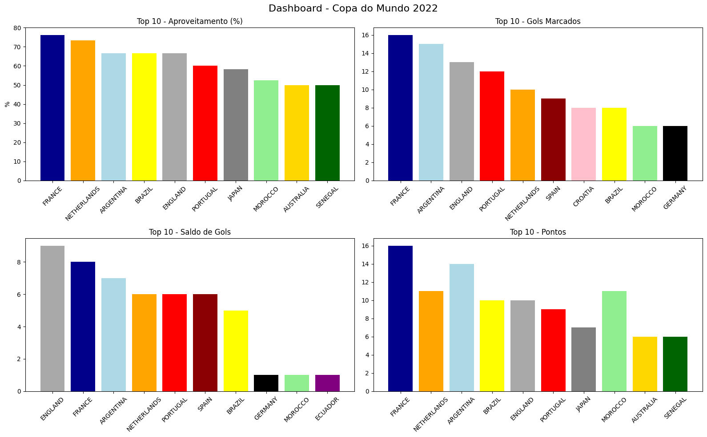

# 📊 Análise da Copa do Mundo 2022

Projeto de análise de dados utilizando Python e Pandas com base nos jogos da Copa do Mundo de 2022.

## 🎯 Objetivo

Explorar os dados da competição para entender o desempenho das seleções, utilizando métricas e visualizações.

---

## 🔍 Análises realizadas

- Total de seleções participantes
- Total de jogos
- Seleção com mais gols marcados
- Seleção mais vazada
- Saldo de gols (melhor e pior)
- Jogo com mais gols
- Ranking de aproveitamento (modelo oficial: 3 pontos por vitória e 1 por empate)

---

## 📊 Dashboard

O projeto inclui um dashboard com:

- Top 10 seleções por aproveitamento
- Top 10 seleções por gols marcados
- Top 10 seleções por saldo de gols
- Top 10 seleções por pontos



---

## 🛠️ Tecnologias utilizadas

- Python
- Pandas
- NumPy
- Matplotlib

---

## ⚡ Execução rápida

```bash
git clone https://github.com/SEU_USUARIO/copa-do-mundo-2022-analise.git
cd copa-do-mundo-2022-analise
pip install -r requirements.txt
python Analise_Copa_do_Mundo_2022.py


